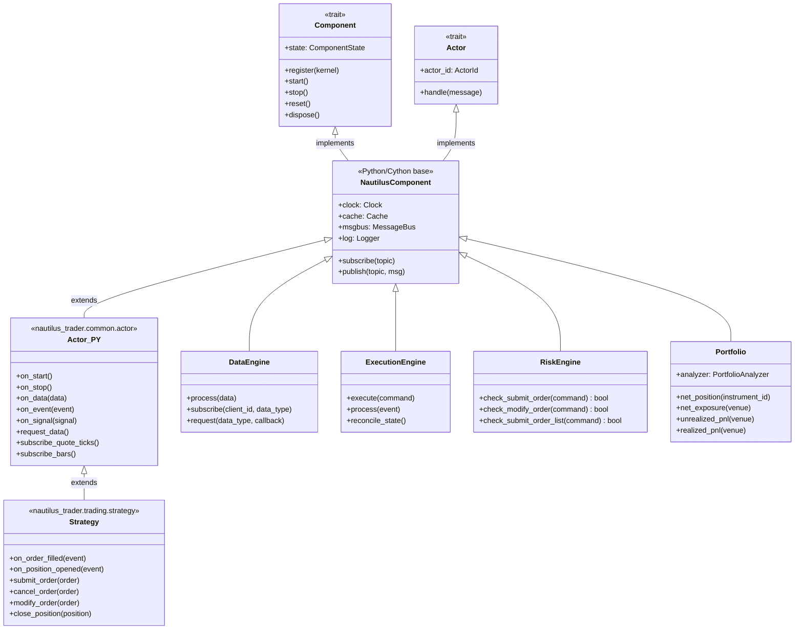
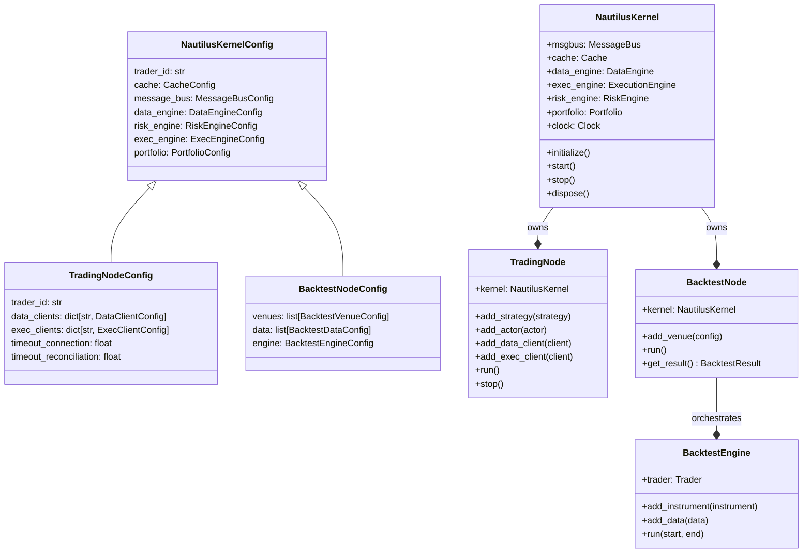
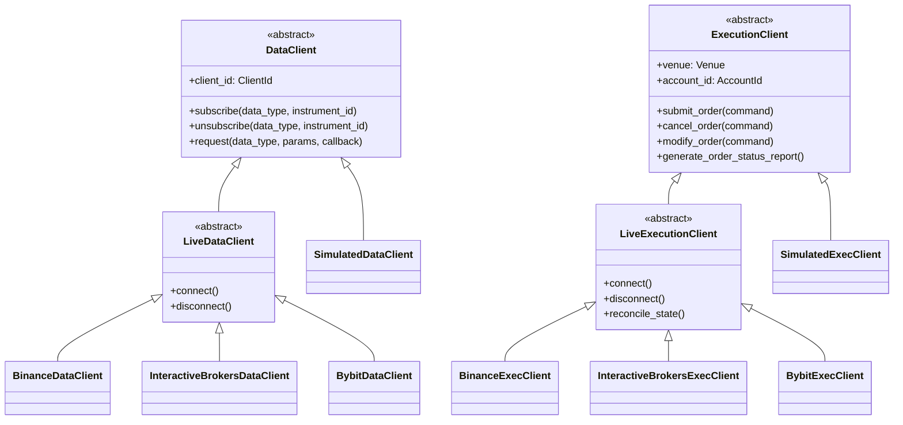
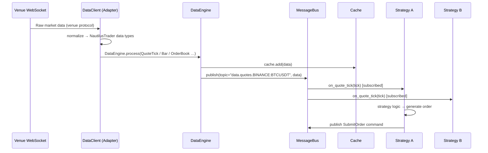
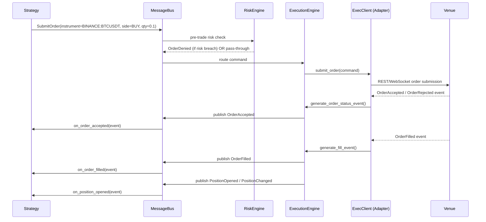
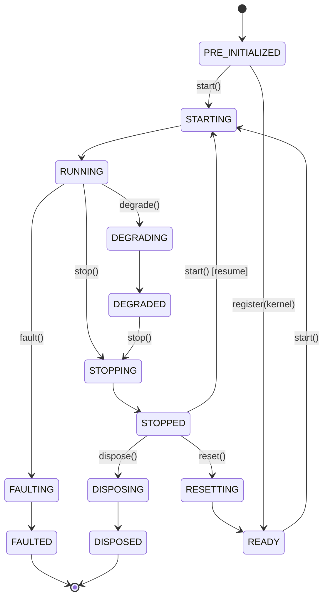

# NautilusTrader — System Architecture Diagram

> **Repository**: [nautechsystems/nautilus_trader](https://github.com/nautechsystems/nautilus_trader)  
> **Version analysed**: `develop` branch (March 2026)  
> **Engine paradigm**: Deterministic, event-driven, single-threaded kernel · Rust-native core · Python control plane

---

## 1. 30,000-foot View — System Paradigm

NautilusTrader is structured around a single **`NautilusKernel`** per OS process (a "trader instance" or "node").  
The kernel is the innermost ring; everything else — venues, strategies, actors — is plugged in around it through the **MessageBus** and the **ports-and-adapters** pattern.

```
┌──────────────────────────────────────────────────────────────────────────────────────────┐
│  OS PROCESS  (one TradingNode / BacktestNode per process)                                │
│                                                                                          │
│  ┌────────────────────────────────────────────────────────────────────────────────────┐  │
│  │  NautilusKernel  (single-threaded event loop — LMAX disruptor-inspired)            │  │
│  │                                                                                    │  │
│  │   MessageBus ◄──────────────────────────────────────────────────────────────────  │  │
│  │       │  Pub/Sub · Req/Rep · Command/Event                                         │  │
│  │       ▼                                                                            │  │
│  │   ┌──────────┐  ┌──────────┐  ┌──────────┐  ┌──────────┐  ┌──────────────────┐   │  │
│  │   │  Cache   │  │DataEngine│  │ExecEngine│  │RiskEngine│  │   Portfolio      │   │  │
│  │   └──────────┘  └──────────┘  └──────────┘  └──────────┘  └──────────────────┘   │  │
│  │                                                                                    │  │
│  │   ┌──────────────────────────────────────────────────────────────────────────┐    │  │
│  │   │  Actor / Strategy Registry  (N strategies, M actors — all on same bus)   │    │  │
│  │   └──────────────────────────────────────────────────────────────────────────┘    │  │
│  └────────────────────────────────────────────────────────────────────────────────────┘  │
│                                                                                          │
│  ┌──────────────────────────────────┐   ┌──────────────────────────────────┐            │
│  │  DataClient adapters             │   │  ExecutionClient adapters        │            │
│  │  (one per venue / data feed)     │   │  (one per venue / account)       │            │
│  └──────────────────────────────────┘   └──────────────────────────────────┘            │
│          │ async WebSocket / REST                │ async WebSocket / REST               │
└──────────┼──────────────────────────────────────┼──────────────────────────────────────┘
           ▼                                       ▼
   Exchange A  Exchange B  Exchange C …     (same venues, separate clients)
```

**Key design decisions:**

| Decision | Rationale |
|---|---|
| One node per process | Avoids shared global state (Tokio runtime, loggers, FORCE_STOP flag) |
| Single-threaded kernel | Deterministic event ordering; backtest ↔ live parity |
| Ports & adapters | Any REST/WebSocket venue integrated without changing core |
| Shared MessageBus | All strategies & actors subscribe; no direct coupling between them |
| Unified Portfolio | Single portfolio object aggregates across all venues & strategies |

---

## 2. Class Hierarchy

### 2a. Component & Actor Trait Hierarchy (Rust core → Python surface)



### 2b. Node / Kernel Hierarchy



### 2c. Adapter Hierarchy (Ports & Adapters)



---

## 3. Multi-Venue · Multi-Strategy · Multi-Portfolio Paradigm

### The Core Insight

NautilusTrader deliberately has **one** portfolio and **one** cache per node. Multi-dimensionality is achieved by **namespacing through IDs**, not by instantiating separate portfolio objects.

```
┌─────────────────────────────────────────────────────────────────────────────┐
│                          SINGLE TRADING NODE                                │
│                                                                             │
│  ┌─────────────────────────────────────────────────────────────────────┐   │
│  │  STRATEGIES (all share the same MessageBus, Cache, Portfolio)        │   │
│  │                                                                      │   │
│  │  StrategyA (id="EMACross-BTCUSDT-001")   ← instrument: BTC/USDT      │   │
│  │    ├─ subscribes to: QuoteTick[BINANCE:BTCUSDT]                      │   │
│  │    └─ submits orders to: BINANCE exec client                         │   │
│  │                                                                      │   │
│  │  StrategyB (id="MarketMaker-ETHUSDT-001") ← instrument: ETH/USDT     │   │
│  │    ├─ subscribes to: OrderBook[BINANCE:ETHUSDT]                      │   │
│  │    └─ submits orders to: BINANCE exec client                         │   │
│  │                                                                      │   │
│  │  StrategyC (id="StatArb-ES-NQ-001")      ← cross-venue arb           │   │
│  │    ├─ subscribes to: Bar[CME:ES] and Bar[CME:NQ]                     │   │
│  │    └─ submits orders to: IB exec client (CME)                        │   │
│  └─────────────────────────────────────────────────────────────────────┘   │
│                                                                             │
│  ┌─────────────────────────────────────────────────────────────────────┐   │
│  │  VENUE ADAPTERS                                                      │   │
│  │                                                                      │   │
│  │  DataClients:   [BINANCE_SPOT] [BINANCE_FUTURES] [IB]               │   │
│  │  ExecClients:   [BINANCE_SPOT] [BINANCE_FUTURES] [IB]               │   │
│  └─────────────────────────────────────────────────────────────────────┘   │
│                                                                             │
│  ┌─────────────────────────────────────────────────────────────────────┐   │
│  │  PORTFOLIO (unified — aggregates all venues & strategies)            │   │
│  │                                                                      │   │
│  │  Accounts:    { BINANCE_SPOT: Account, BINANCE_FUTURES: Account,    │   │
│  │                 IB: Account }                                        │   │
│  │  Positions:   keyed by (PositionId → strategy_id + instrument_id)   │   │
│  │  Net PnL:     queryable per venue, per instrument, or total          │   │
│  └─────────────────────────────────────────────────────────────────────┘   │
└─────────────────────────────────────────────────────────────────────────────┘
```

### Multi-Portfolio Isolation Pattern

NautilusTrader does **not** provide separate Portfolio objects per strategy. Instead, isolation is achieved by:

1. **Strategy ID namespacing** — every order and position is tagged with its `strategy_id`, so per-strategy PnL can be reconstructed from the unified portfolio/cache.
2. **Separate nodes in separate processes** — for hard isolation (e.g., separate risk limits), run two `TradingNode` processes; each gets its own kernel, cache, and portfolio.

```
Process 1 (TradingNode "Alpha-Fund")          Process 2 (TradingNode "Beta-Fund")
├─ Strategy: LongOnlyEquity                   ├─ Strategy: HFT-MarketMaker
├─ Venue: Interactive Brokers                 ├─ Venue: Binance Futures
├─ Portfolio: tracks IB account               ├─ Portfolio: tracks BINANCE_FUTURES
└─ Risk limits: position size $1M             └─ Risk limits: delta-neutral ±$50K
```

---

## 4. Data Flow



---

## 5. Execution Flow



---

## 6. Component State Machine

Every component (DataEngine, ExecutionEngine, RiskEngine, Strategy, Actor) follows this FSM:



---

## 7. Codebase Layer Map

```
nautilus_trader/                     crates/  (Rust)
│                                    │
├── core/          ← constants       ├── core/        ← primitives, UUID, math
├── common/        ← shared infra    ├── common/      ← MessageBus, Clock, Cache
├── model/         ← domain model    ├── model/       ← Price, Quantity, Order, Position
├── accounting/    ← account types   ├── data/        ← DataEngine
├── cache/         ← Cache impl      ├── execution/   ← ExecutionEngine
├── data/          ← DataEngine      ├── risk/        ← RiskEngine
├── execution/     ← ExecEngine      ├── portfolio/   ← Portfolio
├── risk/          ← RiskEngine      ├── trading/     ← Actor, Strategy base
├── portfolio/     ← Portfolio       ├── system/      ← NautilusKernel
├── trading/       ← Strategy base   ├── backtest/    ← SimulatedExchange
├── indicators/    ← built-in        ├── live/        ← LiveNode runtime
├── analysis/      ← statistics      ├── adapters/    ← Binance, IB, Bybit …
├── persistence/   ← Parquet/catalog ├── pyo3/        ← Python bindings (PyO3)
├── serialization/ ← msgpack/JSON    └── network/     ← async WebSocket/REST
├── adapters/      ← venue adapters
├── backtest/      ← BacktestNode
├── live/          ← TradingNode
└── system/        ← NautilusKernel
```

**Dependency flow** (arrows = depends on):

```
Strategy / Actor
      │
      ▼
  NautilusKernel  ──►  MessageBus  ──►  Cache
      │                    │
      ▼                    ▼
  DataEngine          ExecutionEngine  ──►  RiskEngine
      │                    │
      ▼                    ▼
  DataClient          ExecutionClient
  (per venue)         (per venue)
      │                    │
      └──────────┬──────────┘
                 ▼
           Venue / Exchange
```

---

## 8. Environment Context Swap Table

The same strategy code runs in all three environments. Only the injected implementations change:

| Component | Backtest | Sandbox | Live |
|---|---|---|---|
| `Clock` | `TestClock` (simulated time) | `LiveClock` | `LiveClock` |
| `DataClient` | `BacktestDataClient` (replays Parquet) | Live adapter | Live adapter |
| `ExecutionClient` | `SimulatedExchangeClient` | `SimulatedExchangeClient` | Live adapter |
| `MessageBus` | In-memory | In-memory or Redis | In-memory or Redis |
| `Cache` | In-memory | In-memory or Redis | In-memory or Redis |
| Node type | `BacktestNode` / `BacktestEngine` | `TradingNode` (sandbox mode) | `TradingNode` |

---

## 9. Multi-Venue Configuration Pattern (Live)

```python
config = TradingNodeConfig(
    trader_id="MyTrader-001",

    # ── Data sources ── one DataClient per venue/account-type
    data_clients={
        "BINANCE_SPOT":    BinanceDataClientConfig(account_type=SPOT),
        "BINANCE_FUTURES": BinanceDataClientConfig(account_type=USDT_FUTURES),
        "IB":              InteractiveBrokersDataClientConfig(),
    },

    # ── Execution venues ── one ExecClient per venue/account-type
    exec_clients={
        "BINANCE_SPOT":    BinanceExecClientConfig(account_type=SPOT),
        "BINANCE_FUTURES": BinanceExecClientConfig(account_type=USDT_FUTURES),
        "IB":              InteractiveBrokersExecClientConfig(),
    },
)

node = TradingNode(config=config)

# ── Multiple strategies ── each independently subscribes/trades
node.add_strategy(EMACrossStrategy(config=StrategyConfig(instrument_id="BINANCE_SPOT:BTCUSDT")))
node.add_strategy(MarketMakerStrategy(config=StrategyConfig(instrument_id="BINANCE_FUTURES:ETHUSDT-PERP")))
node.add_strategy(StatArbStrategy(config=StrategyConfig(instruments=["IB:ES", "IB:NQ"])))

# ── Optional: custom actors (e.g. signal publishers, portfolio monitors)
node.add_actor(RiskMonitorActor())
node.add_actor(SignalPublisherActor())

node.run()   # blocks; starts event loop
```

---

## 10. Summary: Architectural Principles

| Principle | Implementation |
|---|---|
| **Event-driven** | All state changes are events on the MessageBus; no polling |
| **Domain-driven design** | Rich domain model: `Order`, `Position`, `Instrument`, `Price`, `Quantity` etc. |
| **Ports & adapters** | `DataClient` / `ExecutionClient` are the ports; venue connectors are adapters |
| **Single-threaded kernel** | Deterministic ordering; network I/O on background async threads |
| **Crash-only** | Panics abort the process; state re-hydrated from Redis on restart |
| **Fail-fast** | Arithmetic overflow, NaN prices, invalid types → immediate panic |
| **Research-to-live parity** | Identical strategy code across backtest, sandbox, live via clock/adapter swaps |
| **Multi-venue** | N DataClients + N ExecClients per node, all routed through one kernel |
| **Multi-strategy** | N strategies registered on the same node, isolated by `strategy_id` namespacing |
| **Multi-portfolio** | Soft isolation: per-strategy PnL via ID tagging; hard isolation: separate processes |
